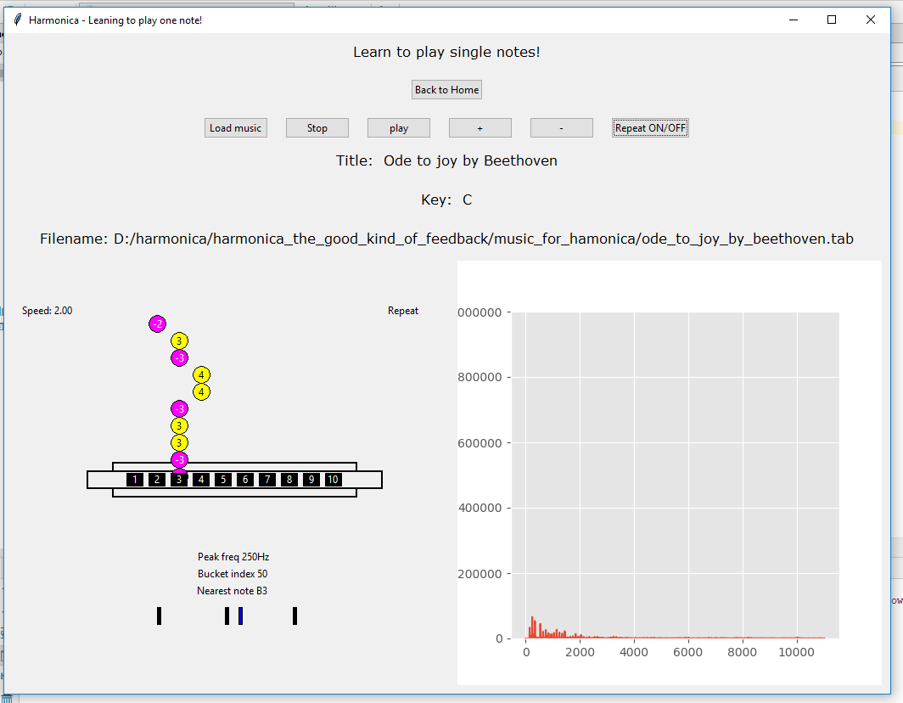

# Harmonica - The good kind of feedback

## Description

This is a little program to help in the process of learning the harmonica, especially the part of learning to play single notes, for harmonicas in the key of C. It shows the spectrogram and a visual representation of the holes of the harmonica being played. It also contains a kind of “harmonica hero”. The exercises and the songs can be loaded by the program from any directory; they are a simple text file renamed to ‘.tab’ with a 2 lines small header followed by the tablature of the song. The song can have comments and they are any line that starts with the symbol ‘#’. I will give an example of the format for an easy understanding of it:   

name: name_of_the_music by autor 
key: C 
-1 2 1’’’ 
1 2 3 4 5 6   

The '-' represent a Draw note and without '-' a Blow note. The numbers represent the 1 to 10 holes in a diatonic 10 holes harmonica. The ' represent one bend, the '' represent two bends and the ''' represents three bends.  

  

  

License: MIT Open Source License  

## Installation

The libs that it depends on are, Python 3.6, NumPy, TKinter, MatPlotLib, PyAudio, Pillow. But for a simpler installation I recommend you to use the Python distribution Anaconda for Python 3.6 or latter. And then make the following commands in the Anaconda prompt shell:  

[Cypress](https://www.anaconda.com/download/)  

pip install pyaudio  
conda install -c conda-forge pillow    
then to execute  
python  harmonica_the_good_kind_of_feedback.py    

